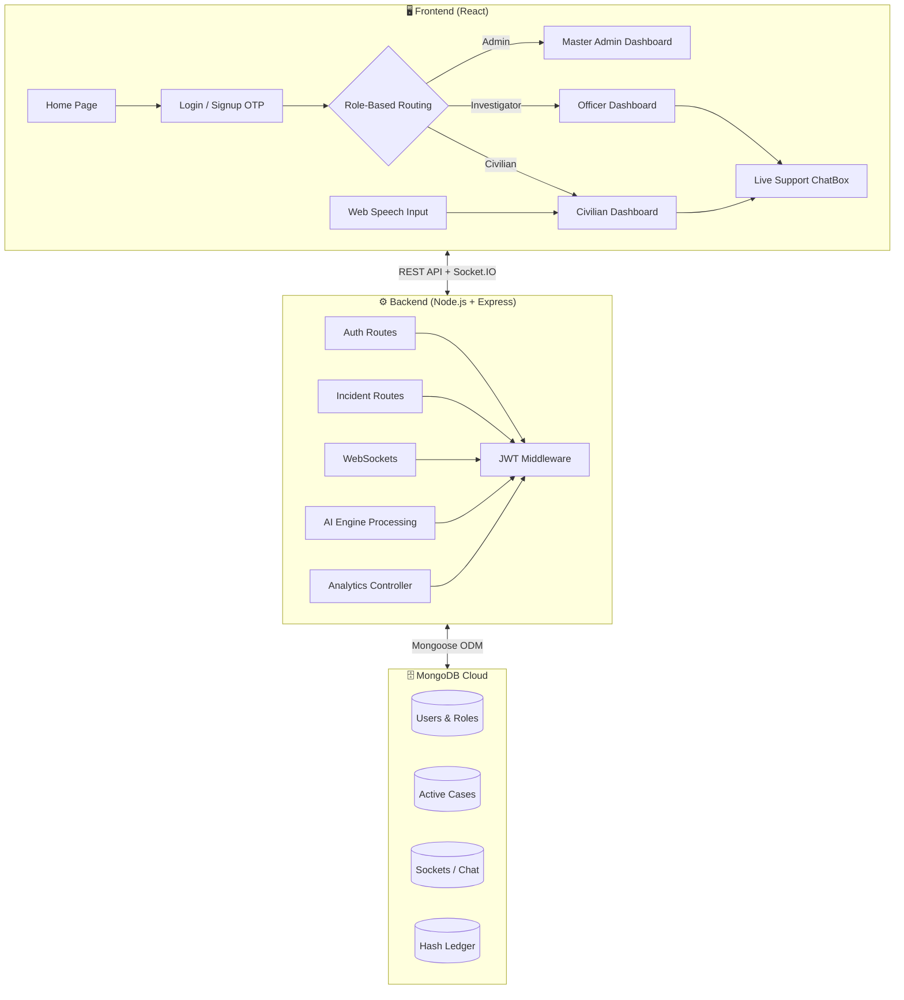

<p align="center">
  
</p>

<p align="center">
  <a href="#-problem-statement"></a>
  <a href="#-tech-stack"></a>
  <a href="#-quick-start"></a>
  <a href="#-team"></a>
</p>

<p align="center">
  
  
  
  
  
  
</p>

<br/>

<p align="center">
  <picture>
    <source media="(prefers-color-scheme: dark)" srcset="https://raw.githubusercontent.com/platane/snk/output/github-contribution-grid-snake-dark.svg" />
    <source media="(prefers-color-scheme: light)" srcset="https://raw.githubusercontent.com/platane/snk/output/github-contribution-grid-snake.svg" />
    
  </picture>
</p>

---

## 📋 Table of Contents
<details open>
<summary><b>Click to expand/collapse</b></summary>

- [🌟 About Chakravyuha](#-about-chakravyuha)
- [🚨 Problem Statement](#-problem-statement)
- [✨ Key Deliverables](#-key-deliverables)
- [🏗️ System Architecture](#️-system-architecture)
- [⚡ Tech Stack](#-tech-stack)
- [📁 Folder Structure](#-folder-structure)
- [🚀 Quick Start](#-quick-start)
- [📊 Constraints & Compliance](#-constraints--compliance)
- [👥 Team Hawkins Hacker](#-team)

</details>

---

## 🌟 About Chakravyuha
<table>
<tr>
<td width="60%">

**Chakravyuha 1.0 (CyberShield)** is an elite, real-time cybersecurity evidence portal designed specifically for the **24-Hour Hackathon (Cyber Security Domain)**. 

Rooted in the concept of *Defense in Depth*, it enables organizations and law enforcement agencies to efficiently manage cyberattack reports through an intelligent triage workflow, substituting delayed bureaucratic filing with **Real-Time Socket.IO communication**, strict Role-Based Access Controls (RBAC), and simulated **Blockchain-based Evidence Vaults**.

</td>
<td width="40%">

```text
  ╔══════════════════════════╗
  ║    🛡️ CHAKRAVYUHA        ║
  ║                          ║
  ║  ┌────────┐ ┌────────┐   ║
  ║  │ Civilian │→│ Attack │   ║
  ║  └────────┘ └───┬────┘   ║
  ║                 │        ║
  ║  ┌────────┐ ┌───▼────┐   ║
  ║  │ Officer│←│ Assign │   ║
  ║  └────────┘ └───┬────┘   ║
  ║                 │        ║
  ║  ┌────────┐ ┌───▼────┐   ║
  ║  │ Master │→│ Secured│   ║
  ║  └────────┘ └────────┘   ║
  ╚══════════════════════════╝
```

</td>
</tr>
</table>

---

## 🚨 Problem Statement: Real-Time Digital Evidence Preservation
**Client:** Cybercrime Investigation Unit/Law Enforcement Agencies - Hypothetical Deployment

### Background & Scenario
Most people have come across cyber fraud—whether via a phishing link, fake application, or convincing phone call. In many cases, it only takes a single action for an attack to succeed. The realization that personal or financial data has been compromised often comes suddenly.

Typically, victims respond quickly by contacting their bank and reporting the issue. At this stage, it appears the system is working. However, the exact situation behind the scenes is far more complex:

> **When a cybercrime incident occurs, there is a critical delay between the time of attack and the start of a formal investigation.** During this window, attackers can access compromised systems, remove traces of their activity, and eliminate valuable digital evidence. The victim's complaint typically moves through multiple layers. By the time investigators access the system, most of the crucial evidence has already been erased, making it extremely difficult to trace the attacker.

### ⚠️ Key Pain Points
- **Delay in Evidence Collection:** No mechanism to immediately capture digital evidence.
- **Loss of Critical Data:** Attackers often delete logs and remove traces of activities.
- **Fragmented Reporting Process:** Complaints pass through multiple administrative levels, causing massive delays.
- **Lack of Real-time Systems:** No integrated system connects victims directly to investigators in real time.
- **Ineffective Investigation Outcomes:** Due to missing evidence, many cases remain completely unresolved.

### 🛑 Real-World Complications
- **Coordination Challenges:** Multiple agencies involved; slow and inefficient coordination.
- **User Awareness:** Victims unknowingly alter or delete vital data before it is preserved.
- **Legal & Privacy Constraints:** Must ensure data compliance via encrypted systems.
- **Technology Limitations:** Devices configuration variations make standardization difficult.

---

## ✨ Key Deliverables (Achieved in 24 Hours)

<table>
<tr>
<td>

✔️ **System Architecture Document:** Instant capture and secure storage flow logic mapped via RBAC nodes.<br/>
✔️ **Working Prototype:** Fully functional MERN system capturing cases, logs, and evidence payloads.<br/>
✔️ **Evidence Mechanism:** Log collection and timestamping via native Audio APIs ensuring data integrity.<br/>
✔️ **Alert & Reporting:** Streamlined portal routing incidents to domain-specific authorities (Phishing/Fraud/Malware).<br/>
✔️ **Security Integrity:** Captured data is tamper-proof, employing highly validated `SHA-256` logic.<br/>
✔️ **Scalability & Privacy:** Modular system engineered for concurrency with user consent via strict RBAC.

</td>
</tr>
</table>

### 🔥 Bonus Challenges Integrated
- **Automated Incident Triggering:** AI handles domain sorting automatically without officer intervention.
- **Blockchain-Based Evidence Storage [Simulated]:** `SHA-256` hashing enforces mathematical immutability.
- **Cross-Platform Synchronization:** Evidence collection functions explicitly across multiple devices.
- **AI-Assisted Investigation Support:** Generates intelligent case briefs automatically saving investigator read-time.
- **User Guidance System:** Interactive dashboards guide victims during emergency report logging flawlessly.

---

## 🏗️ System Architecture

Our MERN stack architecture operates on a highly optimized pipeline designed for instant triggering with zero persistence of vulnerable cross-role data.



---

## ⚡ Tech Stack

<div align="center">

| Layer | Technology | Purpose |
|:---:|:---:|:---:|
|  | React.js | Blazing-fast responsive UI rendering |
|  | Framer Motion | Smooth page transitions & animations |
|  | Recharts | Live Interactive data analytics |
|  | Express.js | Secure RESTful API server routing |
|  | MongoDB | Scalable NoSQL data persistence |
|  | Socket.IO | Lightning Bidirectional communication |
|  | JWT + Bcrypt | Bank-grade authentication encryption |
|  | Nodemailer | Live Two-Factor OTP validations |
|  | Crypto API | Core Tamper-proof Evidence Hashing |

</div>

---

## 📊 Constraints & Compliance
| Constraint | Requirement | Status |
|------------|-------------|--------|
| **Response Time** | Immediate evidence capture (within seconds to minutes) | ✅ WebSockets |
| **Deployment** | Lightweight tool (web-based application) | ✅ React SPA |
| **Data Handling** | Secure storage with tamper-proof mechanisms | ✅ SHA-256 Crypto |
| **Integration** | Compatibility with law enforcement systems | ✅ IO Dashboards |
| **Privacy** | Must protect user data and comply with legal frameworks | ✅ Strict RBAC tokens |
| **Accessibility**| Easy to use for non-technical users | ✅ Web Speech mic |

---

## 📁 Folder Structure
```bash
Chakravyuha/
├── frontend/           # 💻 React User Interface
│   ├── src/
│   │   ├── components/ # 🧩 Reusable glassmorphic UI elements
│   │   ├── pages/      # 🖥️ Segregated Civilian, IO, Admin Dashboards
│   │   ├── styles/     # 🎨 Aesthetic neon cyber global CSS
│   │   └── App.js      # 🛡️ Main routing authorization
├── backend/            # ⚙️ Node.js REST API & WebSocket Server
│   ├── controllers/    # 🧠 Core logic (Cases, Auth routing)
│   ├── middleware/     # 🔐 JWT decoders & File parsers
│   ├── models/         # 🗄️ Mongoose strictly typed schemas
│   ├── sockets/        # 🔌 Real-time TCP push handlers
│   └── server.js       # 🚀 Master application loop
```

---

## 🚀 Quick Start (Local Setup)

```bash
# 1. Clone the repository
git clone https://github.com/poojamurugan23/CyberShield-project.git
cd CyberShield-project

# 2. Build Environment Variables (Backend)
# Create a .env file inside /backend:
# PORT=5000
# MONGO_URI=mongodb://127.0.0.1:27017/cybershield
# JWT_SECRET=super_secret_key
# EMAIL_USER=your_gmail
# EMAIL_PASS=your_gmail_app_key

# 3. Boot Multiple Terminal Servers
# Terminal 1:
cd backend && npm install && npm start

# Terminal 2:
cd frontend && npm install && npm start
```

---

<div align="center">

## 👥 Team
### 🏆 **Hawkins Hacker** — University College of Engineering, Kanchipuram

<br/>

<table style="border-collapse: collapse; border: none; background: transparent;">
  <tr>
    <td align="center" width="25%">
      
      <br/><br/>
      
      <br/>
      <br/>
      <sub><b>System Security Implementation <br>& Core Logic Development</b></sub>
    </td>
    <td align="center" width="25%">
      
      <br/><br/>
      
      <br/>
      <br/>
      <sub><b>UI/UX Design & User <br>Interaction Experience</b></sub>
    </td>
    <td align="center" width="25%">
      
      <br/><br/>
      
      <br/>
      <br/>
      <sub><b>Research Analysis & <br>Technical Documentation</b></sub>
    </td>
    <td align="center" width="25%">
      
      <br/><br/>
      
      <br/>
      <br/>
      <sub><b>Overall System Architecture <br>Design & Integration</b></sub>
    </td>
  </tr>
</table>

<br/>


</div>