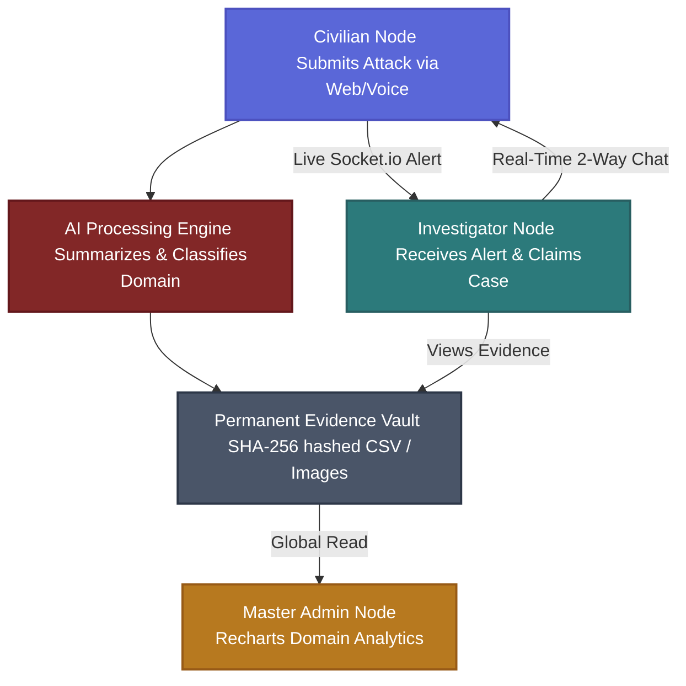

<div align="center">

# 🛡️ CHAKRAVYUHA 1.0: Real-Time Digital Evidence Vault
### *24-Hour Hackathon (Cyber Security domain)*


[](#)
[](#)
[](#)
[](#)

*Empowering Law Enforcement with Instant, Tamper-Proof Digital Evidence.*

</div>

<br/>

## 🚨 Problem Statement: Real-Time Digital Evidence Preservation
**Client:** Cybercrime Investigation Unit/Law Enforcement Agencies - Hypothetical Deployment

### Background & Scenario
Most people have either experienced or come across cyber fraud in some form—whether it is a phishing link, a fake application, or a phone call that convincingly imitates a trusted source. In many cases, it only takes a single action for an attack to succeed. The realization that personal or financial data has been compromised often comes suddenly and can be overwhelming.

Typically, victims respond quickly. They contact their bank to block transactions, report the issue to authorities, and file a formal complaint. At this stage, it appears that the system is responding as expected. However, the actual situation behind the scenes is far more complex:

> **When a cybercrime incident occurs, there is a critical delay between the time of attack and the start of a formal investigation.** During this window, attackers can access compromised systems, remove traces of their activity, and eliminate valuable digital evidence. The victim's complaint typically moves through multiple layers—from local police stations to district authorities and then to specialized cybercrime units. This process often takes several days before any technical investigation begins. By the time investigators access the affected system, most of the crucial evidence has already been erased, making it extremely difficult to trace the attacker or reconstruct the incident.

### ⚠️ Key Pain Points
- **Delay in Evidence Collection:** There is no mechanism to immediately capture and preserve digital evidence at the moment a cybercrime is detected or reported.
- **Loss of Critical Data:** Attackers often delete logs, clear histories, and remove traces of their activities, leaving little to no evidence for investigators.
- **Fragmented Reporting Process:** Complaints pass through multiple administrative levels before reaching cybercrime specialists, causing significant delays.
- **Lack of Real-Time Response Systems:** There is no integrated system that connects victims directly to investigators in real time.
- **Ineffective Investigation Outcomes:** Due to missing or incomplete evidence, many cases remain unresolved despite proper reporting procedures being followed.

### 🛑 Real-World Complications
- **Coordination Challenges:** Multiple agencies are involved in the process, and coordination between them is often slow and inefficient. 
- **User Awareness:** Victims may not know how to preserve evidence or may unknowingly alter or delete important data.
- **Legal and Privacy Constraints:** Any system must ensure that user data is handled securely and complies with legal standards.
- **Technology Limitations:** Devices may vary widely in terms of operating systems, configurations, and security capabilities, making standardization difficult.

---

## 💡 Our Ideology & Solution
We engineered **Chakravyuha** to bridge this exact gap. It replaces slow, fragmented reporting with a strictly permissioned system that acts as an instant bridge, preserving evidence before it vanishes. 

### Expected Deliverables (Achieved within 24 Hours)
- **System Architecture Document:** Designed a solution that enables instant capture and secure storage of digital evidence at the time of incident mapping data flow and integration logic.
- **Working Prototype:** Demonstrated a MERN system that can capture key evidence in real time and securely store it for investigation.
- **Evidence Capture Mechanism:** Implemented features such as automatic log collection, activity tracking, and timestamping via native Audio APIs to ensure data integrity.
- **Alert & Reporting System:** Provided a streamlined dashboard for victims to report incidents instantly, with automated forward routing to relevant authorities.
- **Security & Integrity Measures:** Ensured that captured data is tamper-proof, employing SHA-256 validation for legal investigation standards.
- **Scalability Report:** Modular component system engineered to isolate domain clusters concurrently.
- **Privacy Mechanism:** Incorporated safeguards to ensure user consent via Role-Based Access Controls (RBAC).

### 🔥 Bonus Challenges Addressed
✔️ **Automated Incident Triggering:** AI handles domain sorting automatically mapping to Phishing/Fraud/Malware without officer intervention. <br/>
✔️ **Blockchain-Based Evidence Storage:** `SHA-256` hashing enforces immutability and traceability of captured evidence. <br/>
✔️ **Cross-Platform Synchronization:** PWA-ready responsive dashboard adapting across multiple devices. <br/>
✔️ **AI-Assisted Investigation Support:** Generates intelligent case briefs automatically saving investigator read-time. <br/>
✔️ **User Guidance System:** Interactive dashboards guide victims during emergency report logging explicitly. <br/>

---

## 🏛️ System Architecture

Our MERN stack architecture operates on a highly optimized pipeline designed for instant triggering with zero persistence of vulnerable cross-role data.



<div align="center">
  <br/>
  <i>(Our Live Dashboard Infrastructure)</i><br/>
  
  <br>
  <i>-> [Insert your assigned Dashboard Screenshot Image Here] <-</i>
  <br><br>
</div>

---

## 🗄️ Database Connection Schema 
The backend connects to MongoDB mimicking the strict structure of a high-security vault. Collections include:
- **`Users`**: Encrypted demographics, `bcrypt` hashed passwords, and 2FA OTP tokens.
- **`Incidents`**: Stores triggers, AI domains, severity flags, timestamps, and active `Socket.io` message arrays.
- **`CryptoHashes`**: Append-only SHA-256 signatures of evidence items directly tied to the victim's incident report protecting chain of custody.

---

## 📊 Technical Constraints & Compliance Matrix
| Constraint | Requirement | Status |
|------------|-------------|--------|
| **Response Time** | Immediate evidence capture (within seconds to minutes) | ✅ Handled via WebSockets |
| **Deployment** | Lightweight tool (web-based application) | ✅ React SPA |
| **Data Handling** | Secure storage with tamper-proof mechanisms | ✅ SHA-256 Hashing |
| **Integration** | Compatibility with law enforcement systems | ✅ IO Dashboards |
| **Scalability** | Capable of handling large volumes of incident reports | ✅ MongoDB backend |
| **Privacy** | Must protect user data and comply with legal frameworks | ✅ Strict RBAC tokens |
| **Accessibility**| Easy to use for non-technical users | ✅ Web Speech mic integration |
| **Platform** | Cross-platform (mobile + desktop) | ✅ Responsive CSS Glassmorphism |

---

## 🛠️ Setup & Local Deployment

Get the platform up and running on your local machine instantly:

```bash
# 1. Clone the repository
git clone https://github.com/poojamurugan23/CyberShield-project.git
cd CyberShield-project

# 2. Build Environment Variables (Backend)
# Create a .env file inside /backend with your configurations
# PORT=5000
# MONGO_URI=mongodb://127.0.0.1:27017/cybershield
# JWT_SECRET=super_secret_key

# 3. Boot the API Server
cd backend
npm install
npm start

# 4. Boot the React Frontend
cd ../frontend
npm install
npm start
# (The interface triggers on http://localhost:3000)
```

### 📂 Folder Structure
```bash
CyberShield-Project/
├── frontend/           # 💻 React User Interface
│   ├── src/
│   │   ├── components/ # 🧩 Reusable glassmorphic UI elements
│   │   ├── pages/      # 🖥️ Segregated Civilian, IO, Admin Dashboards
│   │   ├── styles/     # 🎨 Aesthetic neon cyber global CSS
│   │   └── App.js      # 🛡️ Main routing authorization
├── backend/            # ⚙️ Node.js REST API & WebSocket Server
│   ├── controllers/    # 🧠 Core logic (Cases, Auth routing)
│   ├── middleware/     # 🔐 JWT decoders & File parsers
│   ├── models/         # 🗄️ Mongoose strictly typed schemas
│   ├── sockets/        # 🔌 Real-time TCP push handlers
│   └── server.js       # 🚀 Master application loop
```

---

<div align="center">

## 👥 Hackathon Squad: Hawkins Hacker
**University College of Engineering, Kanchipuram**

<br/>

<table style="border-collapse: collapse; border: none;">
  <tr>
    <td align="center">
      
    </td>
    <td>
      <b>Kiruthigaa Rajkumar</b><br/>
      <i>Handles System Security Implementation and Core Logic Development</i>
    </td>
    <td align="center">
      
    </td>
    <td>
      <b>Pooja Murugan</b><br/>
      <i>Handles UI/UX Design and User Interaction Experience</i>
    </td>
  </tr>
  <tr>
    <td align="center">
      
    </td>
    <td>
      <b>Pavithra Balamurugan</b><br/>
      <i>Handles Research Analysis and Technical Documentation</i>
    </td>
    <td align="center">
      
    </td>
    <td>
      <b>Archana Muruganantham</b><br/>
      <i>Handles Overall System Architecture Design and Integration</i>
    </td>
  </tr>
</table>

<br/>


</div>