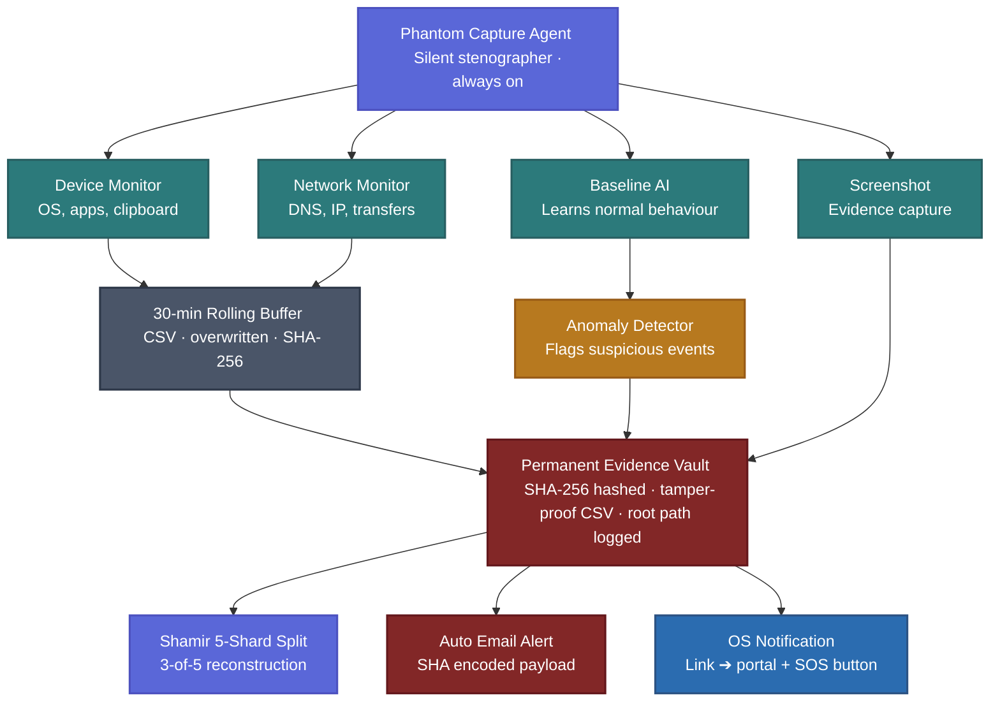

<div align="center">

# 🛡️ CHAKRAVYUHA 1.0: Real-Time Digital Evidence Vault
### *Agent SAKSHI — The Phantom*


[](#)
[](#)
[](#)
[](#)

*Empowering Law Enforcement with Instant, Tamper-Proof Digital Evidence.*

</div>

<br/>

## 🚨 The Problem: Ephemeral Evidence in Cybercrime
When a cybercrime occurs, there is a critical delay between the attack and the formal investigation. During this window, attackers erase logs, clear histories, and destroy valuable digital evidence. By the time the Cybercrime Investigation Unit steps in, the trail is cold. 
**Key Pain Points:**
- **Zero Real-Time Capture:** No mechanism to freeze evidence at the moment of compromise.
- **Fragmented Reporting:** Bureaucratic delays before technical investigation begins.
- **Data Tampering:** Device logs are easily deleted by malicious actors.

---

## 💡 Our Ideology & Solution
**Agent SAKSHI** is a lightweight, strictly permissioned, ethical background agent designed to act as a **"Silent Stenographer"**. 

It passively monitors the system using a 30-minute rolling buffer. The moment anomalous behavior is detected (e.g., suspicious process spikes, multiple login failures, unauthorized network tunneling), SAKSHI instantly crystallizes the last 30 minutes of telemetry, captures screenshots, and packages them into a **Tamper-Proof, SHA-256 Hashed Evidence Vault**. It immediately alerts the user via an OS-level SOS Toast and dispatches encrypted evidence strictly to verified investigators.

---

## 🏛️ System Architecture

Our agent follows a highly optimized, cross-platform pipeline designed for instant triggering with zero persistence of sensitive unencrypted user data.



---

## 🗄️ Database Connection Schema 
The backend connects to MongoDB mimicking the structure of a high-security vault. Collections include:
- `Users`: Encrypted demographics and law-enforcement ID mappings.
- `Incidents`: Stores trigger conditions, metadata, temporal bounds, and IP logs.
- `EvidenceHashes`: An append-only ledger storing the SHA-256 signatures of evidence ZIPs to prevent mid-flight tampering (serving as a blockchain-lite mechanism).

---

## 🛠️ Setup & Local Deployment

Get the Phantom up and running on your local machine instantly:

```bash
# 1. Clone the repository
git clone https://github.com/poojamurugan23/CyberShield-project.git
cd CyberShield-project

# 2. Navigate to the agent branch
git checkout Agent-Sakshi-The-PHANTOM

# 3. Create a virtual environment & activate it
python -m venv .venv
source .venv/bin/activate  # On Windows: .venv\Scripts\activate

# 4. Install Core Engine dependencies
pip install -r requirements.txt

# 5. Build Environment Variables
cp .env.example .env
# Edit .env and supply your SMTP configurations 

# 6. Execute the Agent (Demo Attack Simulation Mode)
python -m agent.main run --demo
# (Watch as the phantom detects, crystallizes, and notifies you instantly!)
```

### 📂 Folder Structure
```bash
Backend Agent V1/
├── agent/
│   ├── main.py         # 🚀 Core Execution Loop & Process Shield
│   ├── config.py       # ⚙️ Constants & Configuration Loader  
│   ├── monitor.py      # 👁️ Telemetry, Port & Process Watcher
│   ├── detector.py     # 🧠 Anomaly Detection & Logic Engine
│   ├── evidence.py     # 📦 Crystallization & Vault Packaging
│   ├── hasher.py       # 🔐 SHA-256 Anti-Tamper Verification
│   ├── emailer.py      # 📧 Encrypted Transmission Pipeline
│   └── notifier.py     # 🔔 High-Priority OS SOS Notifications
├── logs/               # 🔄 Ephemeral 30-min Rolling Buffers
├── evidence/           # 🛑 Permanent Tamper-Proof Archives
├── config.json         # 🎛️ Tunable Thresholds & Preferences
└── requirements.txt    # 📦 Dependency Manifest
```

---

<div align="center">

## 👥 Hackathon Squad: Hawkins Hacker
**University College of Engineering, Kanchipuram**

<br/>

<table>
  <tr>
    <td align="center">
      
    </td>
    <td>
      <b>Kiruthigaa Rajkumar</b><br/>
      <i>System Security Implementation and Core Logic Development</i>
    </td>
    <td align="center">
      
    </td>
    <td>
      <b>Pooja Murugan</b><br/>
      <i>UI/UX Design and User Interaction Experience</i>
    </td>
  </tr>
  <tr>
    <td align="center">
      
    </td>
    <td>
      <b>Pavithra Balamurugan</b><br/>
      <i>Research Analysis and Technical Documentation</i>
    </td>
    <td align="center">
      
    </td>
    <td>
      <b>Archana Muruganantham</b><br/>
      <i>Overall System Architecture Design and Integration</i>
    </td>
  </tr>
</table>

<br/>


</div>
